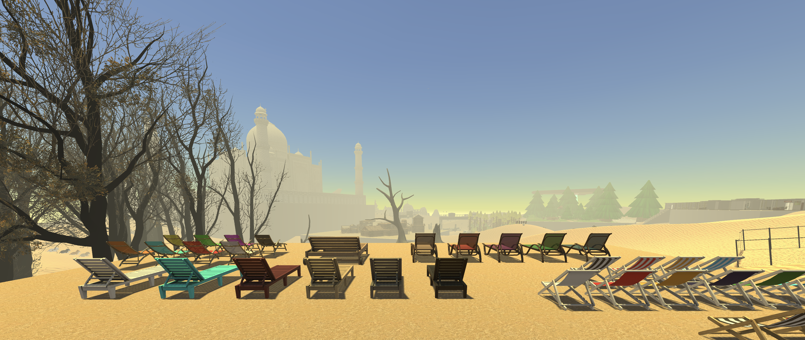
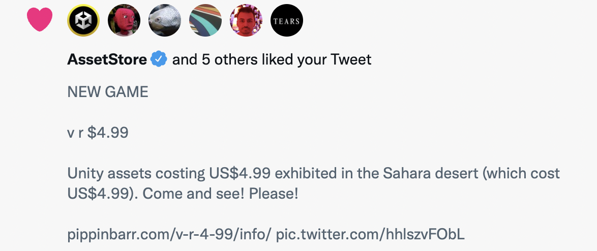

# *v r $4.99*

# Download *v r $4.99* for [Mac](https://github.com/pippinbarr/v-r-4-99/releases/tag/mac) or [Windows](https://github.com/pippinbarr/v-r-4-99/releases/tag/windows). Make sure to pick up the [Visitor's Guide](https://github.com/pippinbarr/v-r-4-99/releases/download/guide/v-r-4-99-visitors-guide.pdf) too!

## Description
*What does $4.99 get you these days?! One crowbar?! Two swordfish?! Three airliners?! Four Sci-Fi doors?! A super store?! The Taj Mahal?! The Sahara desert?! A seagull?! Come and see!*

*v r $4.99* is an exhibition of 3D assets purchased on the Unity Asset Store for US$4.99. The asset store has 46 unique categories of 3D assets, from the baseline 3D category, through to humanoids, dungeon environments, and vegetation. *v r $4.99* contains two examples of each categories, positioned in the Sahara desert (yes, that's an asset that costs $4.99 as well), as an eclectic Noah's Ark of the kinds of things we can see in videogames. You're invited to take a walk around and consider the items on show, maybe ask some questions. Why is an "old mattress" the same price as a complete office interior? Do you prefer realism or low poly? What kind of game would you make with that UFO? What about those "horror trees"? Come one, come all!

*v r $4.99* was created in [Unity](https://unity.com/) and involves heavy use of the [Unity Asset Store](https://assetstore.unity.com/) for obvious reasons. See the game itself for a full listing of assets used, there are informational plinths everywhere. The character controller in the game is [Gold Player](https://github.com/Hertzole/gold-player) by hertzole.

## Documentation
* Read the [Process documentation](../process/) for process journal, to do list, and related work
* Read the [Commit History](https://github.com/pippinbarr/v-r-4-99/commits/master) for step-by-step information about how the project was built
* Look at the [Code Repository](https://github.com/pippinbarr/v-r-4-99) for source code etc. (though note that the repository does not include the assets the game is based on for licensing reasons)

## Press

Read the [Press Kit](../press) for press information

* Rob Beschizza. [An exhibition of $4.99 assets in the Unity game development store](https://boingboing.net/2022/10/05/an-exhibition-of-4-99-assets-in-the-unity-game-development-store.html). Boing Boing. 5 October 2022.
* Cavanagh, Terry. [v r $4.99](https://terrysfreegameoftheweek.com/2022/10/). Terry's Free Game of the Week. 7 October 2022.

*The Asset Store itself liked the game. Doesn't get any better than that.*

## License
*v r $4.99* is an open source game licensed under a [Creative Commons Attribution-NonCommercial 3.0 Unported License](http://creativecommons.org/licenses/by-nc/3.0/). You can obtain the source code from its [code repository](https://github.com/pippinbarr/v-r-4-99) on GitHub. Except that it's totally based on paid assets from the Unity Asset Store, none of which are made available in this repository, so it won't exactly be interesting to work with.
