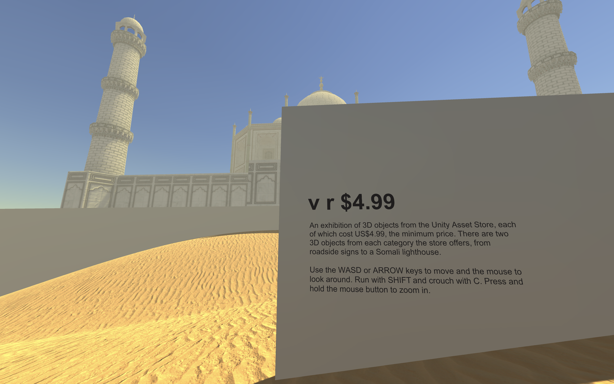

# *v r $4.99* Press Kit

#### Download *v r $4.99* for [Mac](https://github.com/pippinbarr/v-r-4-99/releases/tag/mac) or [Windows](https://github.com/pippinbarr/v-r-4-99/releases/tag/windows). Make sure to pick up the [Visitor's Guide](https://github.com/pippinbarr/v-r-4-99/releases/download/guide/v-r-4-99-visitors-guide.pdf) too!

## The basics

* Developer: [Pippin Barr](http://www.pippinbarr.com/)
* Release: 5 October 2022
* Platform: Mac and Windows
* Code repository: https://www.github.com/pippinbarr/v-r-4-99/
* Price: $0.00 (trust me, I thought about charging $4.99)

## Description
*What does $4.99 get you these days?! One crowbar?! Two swordfish?! Three airliners?! Four Sci-Fi doors?! A super store?! The Taj Mahal?! The Sahara desert?! A seagull?! Come and see!*

*v r $4.99* is an exhibition of 3D assets purchased on the Unity Asset Store for US$4.99. The asset store has 46 unique categories of 3D assets, from the baseline 3D category, through to humanoids, dungeon environments, and vegetation. *v r $4.99* contains two examples of each categories, positioned in the Sahara desert (yes, that's an asset that costs $4.99 as well), as an eclectic Noah's Ark of the kinds of things we can see in videogames. You're invited to take a walk around and consider the items on show, maybe ask some questions. Why is an "old mattress" the same price as a complete office interior? Do you prefer realism or low poly? What kind of game would you make with that UFO? What about those "horror trees"? Come one, come all!

The game is a continuation of my *v r* series which has, roughly speaking, taken a look at the intersection of contemporary art and videogames either by presenting existing contemporary artworks in a videogame setting (*v r 1* remediates Gregor Schneider's work *u r 1*) or presenting components of videogames in an art setting (*v r 2* exhibits the Unity GameObject menu invisibly, *v r 3* exhibits water assets, *v r 2* exhibit the Unity GameObject menu visibly). *v r $4.99* especially draws on the insight from *v r 3* that associating a videogame asset (whether it's a water shader or the Taj Mahal) with a specific price tends to drive critical thought quite nicely. It's much more likely that you'll want to ask questions and have opinions when you're making price-based comparisons. Having every asset be from the $4.99 category aids in that process by making everything in the game "of equal value" (whatever that means). I've certainly found it incredibly generative to walk around the desert and think about the significance of different assets, and what *counts* as value.

## History
This has been a project a long time in the making. By my reckoning (aka checking the documentation) I started in earnest in May 2021, so it's been almost a year and a half at the time of writing. I haven't been working on it all that time as it's come and gone with booms and busts of time and motivation, but still it's almost certainly the most drawn-out game I've ever committed to. This is surprising because on the surface it's incredibly simple: buy 92 assets from the Unity Asset Store and pop them into a desert landscape along with their details and hey presto. Maybe it's "too easy"?

So the history of the game is really a history of motivation ebbs and flows. But it's also true that especially up front there was a ton of thinking to do about curation especially - how to select games, what the criteria were, how to install them consistently in the desert, how to respect the asset creators' work while still having a fairly dynamic exhibition, and so on.

In the end, I'm happy with it and not a little glad to get it off the docket.

## Technical
*v r $4.99* was created in [Unity](https://unity.com/) and involves heavy use of the [Unity Asset Store](https://assetstore.unity.com/) for obvious reasons. See the game itself for a full listing of assets used, there are informational plinths everywhere. The character controller in the game is [Gold Player](https://github.com/Hertzole/gold-player) by hertzole.

## Features
* Seagull!
* Crowbar!
* Taj Mahal!
* Somalian lighthouse!
* Sahara Desert!
* ... and much more!

## Images

## Credits

* Pippin Barr: everything.
* Asset creators: everything as well!

## Contact

* Email: [pippin.barr+press@gmail.com](mailto:pippin.barr+press@gmail.com)
* Website: [www.pippinbarr.com](http://www.pippinbarr.com/)
* Twitter: [@pippinbarr](https://www.twitter.com/pippinbarr)
* Facebook: [Pippin Barr](http://www.facebook.com/pippin.barr)
