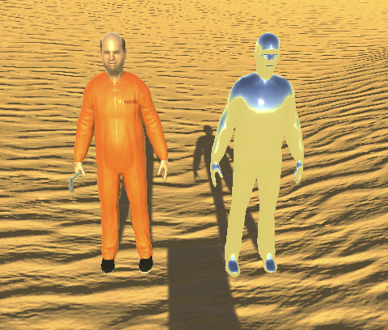

# Curation

## Introduction

This is going to be (in theory) a document where I'll write about curation strategies and so on - is that even a term? Anyway, I want to examine the set of potential assets and take notes about interesting works/assets and why they're interesting. I want to think about the curation heuristics and why I would choose one thing and not another. And I want to think about the actual exhibition staging and where I should put things and why I should put them there. And I want to think about any kind of information design that may well prove necessary.

I don't want this to function as a diary, I want it to be a practical document that gathers my thoughts together, okay? Got it, buster?

## Curatorial heuristics

My plan here is to develop a set of rationales for why one work and not another.

### Variety

* I think my baseline decision making should be around displaying a variety of assets at the price point so we can get a sense of the range, this will presumably invite the most questions from a player (and myself) and that's at the centre of this
* What kinds of categories are there that we can vary?
  * Resolution
  * Realism
  * Skill in execution
  * Size
  * Interactivity/activity
  * Genre connotations
  * Art style (cartoonish, low poly, realism, contemporary, etc.)
  * Quantity of elements (a single car, a collection of cars, a city, a room)
  * Genre of element (object, character, room, terrain, something else...)
  * Animation
  * Natural, fabricated
* There are a lot.

## Exhibition logistics

My plan here is to develop thoughts about how to position things in the space and why.

* Flatness. One issue is that some objects kind of require a flat space to actually work on. If you have a city street grid, say, you can't just embed the whole thing deep into sand dunes and still feel like you're doing is credit? So do I create cubic-platforms that support something like that and allow it to live its best life?
* Rooms. For interiors it may be necessary to build walls to enclose them depending on how they're implemented? I really loved my internal vision, at least, of walking into a kind of simple bunker and ending up in some beautiful room.
* Lighting. Various things look like they have their own lighting settings and preferences (and even rendering pipelines). I can imagine trouble on that front.

### Didacts

What shall they have on them?

* Name of the work
* Author of the work
* Category of the work (Is this like a medium? e.g. 3D > Environments > Landscapes)
* Price of the work ($4.99, duh)
* Size of the work (MB)
* Creation time/date of the work
* Version of the work
* Purchase date/time of the work
* **Maybe** some kind of further information?
* **Ideally** some link to the official asset page

---

# Installation notes

## 27-05-2021 15:03

* Dunes of the Sahara are not great for positioning largely flat objects
* Had to use a cube stand for the biological cells, but it did turn out well at least
* Can lay things out along the bottoms of dunes where it's almost flat, but that would help at all for a large object
* Possible that Sahara is a bad landscape for this, shit
* Lighting fucking sucks okay? Serious issue potential around the ways in which the producers of (perhaps mostly the larger?) assets assume the lighting will be handled - e.g. baked/non, relationship to GI, lighting systems embedded in the model, and so on
* Having partially installed the SuperStore I can at least say it's not a complete disaster? It also raised some interesting questions around things like colliders: the SuperStore doesn't come with them. Initially I'd assumed I would add them because... well because I wanted the store to be "real" in the space, but that's not actually showing you the asset as it is, and in fact the fact it doesn't have colliders is kind of interesting as an experience of the insubstantiality of things? So I put it on a plinth (a big one!) and this means you can walk level with the floor, but that's it. I should probably make some stairs in ProBuilder for the access points. Or rather ramps to be accessible!
* SuperStore has stuff on the top, do I need a viewing platform?! Wow. That's an interesting one.

## 28-05-2021 13:50

* Started install of BBlock yesterday (position) and finished it today (rotation and grounding). Epic process of looking at and moving every single one of around 680 individual pieces, some of which have really awkward shapes (I'm looking at you skinny shallow ramps!). The end result is honestly quite beautiful though
* Raises the question of informational plinth because it's such a large area - I've put one on each of the four "side", but it does still feel a bit like someone might not find them?
* been thinking, too, about map making and read some good ideas online about a special UI layer and associating symbols (UIImage) with that layer and then a sky camera that looks down on them. Should work well. Also still wondering about whether to "tick off" things as you view them, or just let the player/audience remember (probably that one). Wondering about the available resolution on the map and whether it'll display alright if I want to have dots for position and then also at least the title of each work? 88 things is a lot of things...

## 02-06-2021 14:12

* Added roadside marquee. Kind of disappointed to find that the prefabs don't actually have prewritten text on them, and I don't think it's probably fair to use the sample scenes to take them from? Or is it? Not really? Or IS it? HMMMMMMMMMM. This is an interesting question because with a scene the develop is explicitly trying to show off how cool their asset is, so that's a plus. On the other hand it adds a lot of potential contextual extras... gee I don't actually know what to do with that.
* In the end I did use the demo versions from the scene for installation - I think it's a more accurate vision of what the developer thinks about the asset, and I think that's okay.
* Installed low poly campsite. Ran into the issue of its demo scene using an asset for positioning I don't have so had to disable that (feels very much little a dirty little curatorial/installer secret moment). Other than that it works well. Well except the block it's on is super high, so I had to probuild some stairs up to it, but I like that! It's quite beautiful in the end and very chill compared to the desert all around it!
* While installing the ZOMBIE MoCap asset I ran into the fact that their demo animation controller only included four animations in a cycle which doesn't show off everything the thing can do, so I went in and added every single animation in a cycle. BUT it turns out that as far as I can tell this causes the character to move a bit through the cycle so it won't stay aligned... notably it won't stay with its plinth over time... need some way to correct for that. FIXED: disable Apply Root Motion
* Added Personality Animations Kit which is wonderfully blunt and also suggests "typical personalities" like "Sneak" and "Waiter". Oh god that's good. The animation names are so good I had to add a specific "from left to right" part to the label to explain what each one is because I don't want the viewer to miss out. It's a case of me explicitly commenting a bit which I don't know if I love, but it's too too beautiful.
* Added Prisoner-01 but CANNOT for the life of me purchase Prisoner-02... some kind of credit card issue? Why? It seems too scammy? Which is hilarious because it is kind of scammy to just sell these very basic models with the same animation set separately for $4.99 when you think about the other kinds of packages out there. But that's the point... I want Prisoner-01 and Prisoner-02 side by side with their separate plinths etc. to allow that to be a thought in the overall work.

## 03-06-2021 14:25

* The ongoing saga of Prisoners 01 and 02 has been ridiculous. First of all, Prisoner-02 seemed to be the moment that tripped the switch of fraud detection somewhere in the system (many small purchases on my credit card). I talked to both Unity and RBC support and they both steadfastly insisted it wans't them. In the end I paid with PayPal (same credit card) and bought Prisoner 02 successfully. Given how vaguely scammy the Prisoner assets feel, and the fact they're... prisoners... this seems very appropriate.
* Prisoner 01 and Prisoner 02 seem to be incompatible?! Importing Prisoner-02 seems to overwrite Prisoner-01's materials, turning him into a silvery Terminator kind of person. Not desirable. Right now I don't know how to stop this from happening.
* Fixed it eventually - happened because of the naming of the texturing components generically as "albedo" etc. along with the fact that (for some reason) the second prisoner you import will install into the original prisoner's folder (I'm guessing something to do with being from the same dev and they're meant to have a kind of meta folder possibly? Or just a shitty export of the package in general by Astronaut?)

* An extra funny observation just to wrap up Prisoner talk is that they have separate animation controllers that are essentially identical but slightly not, which means they'll get out of synch which is... funny. Ha ha.
* Downloaded and imported Deluxe animal pack v2 and have started laying them out, I settled perhaps too quickly on having the pack of animals in a line along a ridge... does that actually make sense? Good use of a ridge I think? And it has a solo-ride Noah's ark vibe to it? From smallest to biggest... I think it's okay. It's really tedious hand positioning thing though. And because these are animals that will be animated etc it's worse because there's more pressure to have them be lifelike and grounded.
* Hand positioned every animal in Animals deluxe v2 which took what felt like forever, but it does look kind of beautiful.

## 08-06-2021 11:34

* Finally placed all the low poly animals facing the others on the same ridge of a dune and it looks: gorgeous. I think this was a good idea thankfully. Now on with the show.
* Installed a cartoon owl and it is fucking great. It flew around! Had no expectation of that and it was pretty spellbinding. Also particle effects in the presentation of it. Was worrying it was going to be awkward but it's great.
* Can confirm the seagull has been a FUCKING NIGHTMARE. It's quite a simple object on face value, but it's equipped with the ability to fly, eat, attack, walk around. However, in the demo scene this is to be controlled by the player which... well I was thinking it made more sense to be controlled by the game with some shitty AI. But try as I might I haven't been able to make that work.
* Further, I haven't ever been able to get it to fly or take off or anything.
* As I was typing the first point about the seagull I suddenly wonder if it does actually make sense to let the player control the seagull if they're near the plinth?! I'm less sure about the flying but maybe the basics of walking it around? If I could reserve the arrow keys for the seagull and wasd for the player then you could stop at the plinth, read the instructions, and then walk the seagull around yourself a bit?! And make it eat and so on?! (But not fly? Flying is too crazy?) Would it be a bit like one of those flipping dogs where it would be on a plinth with a little rim around it to make sure the seagull can't get off... yeah gee...
* Well that's worth trying. Nope not really! Gets very fiddly because you do need a way to swap between Input meanings (since both my first person controller and the bird controller expect to use the default Axes defined in the Input component). You'd need some kind of complicated message on the plinth telling them to hit some specific key to toggle seagull versus player and it's just not what I want. Why the sweet fuck can't the thing at least walk in a reliable CIRCLE and pick the ground occasionally? THAT IS ALL I WANT FROM IT! I can even live without the flying part which sucks but seems out of reach. GOD DAMN!
* So currently the seagull is feeling like my first major failure... depressing. I should probably move on and install something else less finnicky? Bodes ill though...
* God bless her Rilla had the genius idea of just going with the controller nature of the seagull and saying "fuck it". So the result is a plinth with info about the seagull including controls, then a plinth it stands on at the beginning. But of course in the course of finding that information you'll end up causing the seagull to be elsewhere - you might even run into it while you're walking around and not quite understand you're controlling it?! You might want to go looking for it after you realize what's going on with it? I mean, that's pretty, pretty good. We need walls around the play area (and perhaps up top?) in order to prevent the seagull from being totally lost to play, but basically this is brilliant I think.

## 30-06-2021 11:10

* Added the Swordfish PBR without any real trouble. A reminder of how slow this can be even for an easy one though, what with interfacing with the Unity store, then waiting to download and import, then positioning, then making the plinth, etc.
* The Swordfish is nice because it comes with an animated model and a ragdoll which is quite interesting. It's one of the few interesting ways one of these models can respond to the train in a really appreciable fashion (by flopping on it). Interesting, of course that even this realistic swordfish has animations revolving around incredibly boring game tropes: Swim (fine), attack (Hmm), hurt (geez), dead (oh boy).
* Added Low Poly Fish Pack 1. It's kind of similar to the animal packs to be honest, which is perhaps vaguely disappointing, but in a way it shows a common situation on the store and the most obvious choices you might end up making. The animations for the low poly fish are somewhat useful in that they're the same as above, but explained in the text I'm then able to quote on the plinth. I quite like that their death idle animation just has them bobbing up and down in imaginary water. Fish out of water man.
* That reminds me I had a brief vision of putting the two PBR Swordfish into plinthy situations to evoke Hirst's shark, but I think that's overdoing it in the end.
* As I add more things in proximity to each other, the whole thing of vistas behind the current one you're looking at is really quite nice, with the supermarket and prototyping hill visible behind these latest fish, for example.
* Oh yeah, also meant to say that I'm thinking of added the size of each package to the plinth as a kind of materiality thing, how big these things are is always kind of intriguing. Could add number of files too, but I think that's a little less interesting?
* Added 73 animated butterflies. They're beautiful. Made the decision to position the plinth so the butterflies are nice and bright... though now I look at them it's weirdly on the opposite side to the sun? Is the idea that the light shines through their wings? If so that's very beautiful.

## 02-07-2021 13:58

* Made a shitty informational wall with a door in it just as a placeholder to remind me that I need to make that aspect of the game at some point. Struggled with ProBuilder and snapping, so it's pretty goddamn horrible, but that's la vie. Main thing is it's there to remind.
* Added the Egypt Spiders finally deciding they're definitely in after the little cultural appropriation question etc. They look pretty cool. The demo they come with is boring (just controlling them moving around) and in the end I kind of posed them coming over a dune toward the insects which is quite pleasing. It was a real snap decision though and does make me question how well I'm thinking about positioning as a part of this. I just mostly feel like I can't afford to take it too, too seriously or I will never get this thing made. To some extent so long as the player can see things and know which thing they are, my job is done?
* Added the Cu Puppies and they are FUCKING TINY. I kind of cannot believe just how small they are. It's the first instance, maybe of something having a scale that doesn't make sense to me, and I like that. They're miniscule, more like insects. Add to this that I also added Oscar the Dog from Omabuarts and he is BIG, kind of like a moving balloon animal.
* Fun that both dog types have a sets of animations they rush through, which evokes that sense of a dog that's eager to please. I like these additional moments of sigification outside the basic "this is what you're paying for".
* The Oscar dog comes with multiple LODs which, I mean I don't 100% understand, but essentially versions of the model that are simplified based on how far away it's going to be viewed from. It's nice to present these together because it gives a sense to the viewer of that particular technology and, therefore, of that particular technology having value.
* So, puppy power.

## 16-07-2021 12:26

* Installed exactly one asset, which was T-Rex Model. There turned out to be five prefabs in different sizes and textures, so they're in a circle around the plinth. More and more I find I'm reaching for interesting ways to stage the models to avoid things feeling ultra-repetitive, but I kind of wonder if that's a good idea. In this instance I thought it would be interesting to have to walk into the centre to see them. I also for the moment haven't linked up the animation controller to show every animation state, they're just idling, swinging their tails, which is quite nice.

## 19-07-2021 20:32

* Managed to get "Tyrannosaurus rex dinosaur" installed. It's quite old (2015) and uses the legacy animation system and was set to default to "stand still" which is no animation at all. Had to load their scene and try to figure out a bit of how to make it play any animation, but did get the idle animation going, which matches the previous T-Rex.
* It's pretty underwhelming overall? But it's totally fine. I think there's merit to comparing the two across their year, animation, texturing, etc. There's a funny thing there where there are "more" prefabs of the other t-rex, so is it more valuable? Technically yes? More textures, more content... value value

## 22-07-2021 21:04

* Installing Maksim Bugrimov's monster pack, which attracted me from the first moments I saw it as a kind of monster cabaret thanks to the synched animations. I've now seen a ton of synched animations, of course, so it's less spectacular, but I do think I still like it none the less. It's huge though, almost half a GB? I mean... will this game end up breaking some limit and being impossible to actually build?
* Okay, having actually watched them do their thing they are GREAT. They're like male strippers? Like a Magic Mike kind of thing? I love them very much.

## 28-07-2021 20:44

* I failed to write about the fact I partially installed the Mythological Creatures Pack - Norse a couple of days back. That involved mostly just the process of buying them and popping them in and realizing they're not animated which was quite weirdly disappointing - I've already started to develop certain expectations about what a model pack might involved, though I do see that they include the rigging for standard humanoid animation, which I suppose it close to being as good. But of course because of the way I'm working, I don't add anything like that, so they're just like statues in the sand.
* This evening I moved them into a configuration with the Cabaret/Chippendale Monster Pack which are dancing up a storm. Kind of an interesting confrontation? Like an impassive sports team watching the other team do some kind of dance (or even a haka, though it doesn't have quite that spirit? Though maybe it kiiind of does because a lot of the animations are attack animations?)
* Also there's an "elephant god" in this Norse mythology pack? Seems legit...

## 28-07-2021 21:40

* Already, I've now installed FPS HandJacket and it's pretty fun. It's a pair of arms that are wearing what would be a jacket plus some gloves, with the kind of implication maybe of being the sort of terrorist from Counter-Strike?
* They're quite wonderful! They're nothing more than that description - no code or functionality, just arms, not even arms that look like they would work well as arms in an FPS because I beleive you need some kind of distortion to make them look alright on a camera. Still, not my problem because in this case they're just on the ground - I ended up embedding them in the ground sticking up which looks great and vaguely implies a guy buried under the sand which... well, actually that's fairly interesting too - imaginative possibilities, but also fairly clear from all the other installations that I'm not doing that, so you kind of do know from that (and the information) that it's literally just some fucking arms.
* Love it.