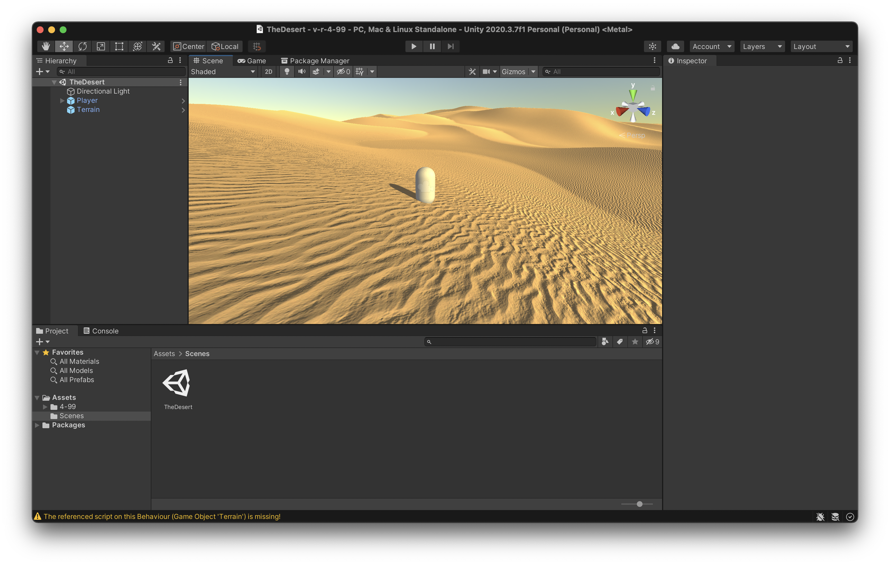
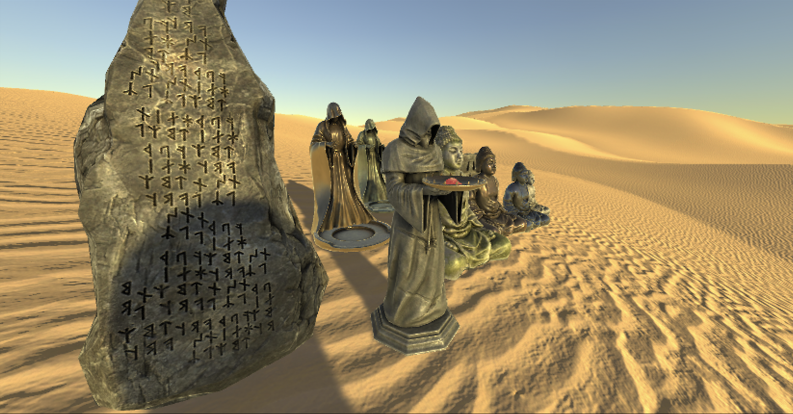
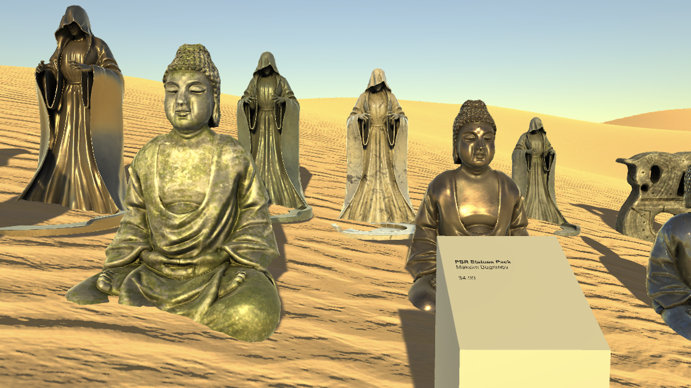

# The starting idea; questions; a glance at Asset Store (06-05-2021 10:51)

Well here I am about to start thinking about this project in the actual harsh light of day instead of the dim light of the bathroom while I'm in the bath thinking of this game.

## The starting idea

As it came to me, the idea was to pursue that element of *v r 3* that was about price comparisons and assessments of the "worth" of water assets into a related game/exhibition purely about the cost of assets on the asset store.

My intial thought was that I would buy assets at different price points and then display them in some way that invites thought about what they're worth etc. Notably

* The idea of paying for something virtual at all (done to death but still important)
* The relationship of different kinds of measures of "quality" to price (resolution, size, apparent effort, relationship of asset to objects considered expensive in the first place, ++)
* The idea of instances and that multiple instances of the same item cost the same, e.g. 100 instances of a $1 asset cost $1, not $100
* Other things here?

Importantly I figure I can leverage the fact I can spend some money from a research account to not give a shit so much about paying for things I wouldn't pay for.

## Questions

I wonder if it's too vague for a player to get a grasp on. Obviously I can have the usual didacts etc. presenting the objects as costing money. I wonder if there's someway to make price comparisons a real thing (that could then leverage things like number of instances, scaling, etc.)? Or perhaps I "just" make installations that draw attention to those particular qualities of the objects in question?

I wonder if there's a need to focus in on a thematic area of the asset store? I mean, I think 3D models is the correct overall thing to look at, but should it only be "horses" or something insane like that? Are there enough horses? But then that because essentially another instance of v r 3 with a harder bent toward money. I guess the choice of items at different price points can really be a key part of it - I'll curate the objects for maximum fun for myself.

I wonder about the nature of the assets you buy - many assets are packs rather than a singular object. Many assets involve animations and interactivity in scripts rather than a static thing, and those things would need to be shown off.

I wonder about how much it could end up costing. If I limited myself to one item at a series of price points then

* $1, $2, $5, $10, $20, $50, $100 would costs a total of $188. Which is totally fine, but it's also only 7 distinct elements.
* 1, 2, 3, 4, 5, 6, 7, 8, 9, 10, 20, 30, 40, 50 would cost a total of $195 which is quite a nice sequence as well?
* What if I found a common price point and just bought a lot of stuff that costs that much? What if I only bought things that cost $4 or roughly that? (People seem to go for the .99 pricing model so perhaps not.)

I wonder what the actual range of prices on the Asset store is. Guess I'll have to... find out!

I wonder about the relationship between ratings and cost - should I be buying the highest rated thing at each price point as a way to navigate that? Should I be buying the highest and lowest rated things?

I wonder about the context/exhibition space and how that will interact with these ideas. There are many different ways to show an object the most obvious right now are

* A traditional gallery space with a focus on looking at them, one item per room, say, or something else
* A more "real" space like something with terrain and trees and all that shit
* A paid-for space in the first place (buy a gallery or a viking village or whatever)
* Some kind of surrealist plain where the imagined horses and other stuff is running around, lying there, etc.

Did that other game at IGF in 2019 already do this??? [circle0](https://igf.com/circle0)? No, not really.

## A glance at the Asset Store

Let's actually just take a look at this thing and see...

**Packs** - as I look at them I can see just dropping every available prefab somewhere and that's that (though this of course raises questions about price versus showing them in their best light? Like if I just dump things from a village pack in a pile am I really exhibiting them in a fair way?)

**Pricing** - so many things are at .99 I'm starting to wonder if I should call this *v r 4.99* or *v r 3.99* ha ha. Maybe I should. There are 62 3D assets priced at $4.99 by the way. If you bought them all it would cost you $309.38. Which is not actually out of the question! Huh. I mean... that's kind of fucking amazing... oh wait, maybe I fucked that up though... yeah I think there's a lot more than that, bugger. Yeah actually there's a bizarre hard line between FREE and $4.99. And there are WAAAAAAYYYY more than 62 things that cost exactly $4.99. Not doable, fuck. That said, I don't have to buy all of them... I do like the idea now of everything costing the same amount I think... and $4.99 is a fun price point for this. There are 6042 3D assets that cost $4.99 for the record, which would cost over $30,000 and probably not the best use of my money.

**Selection** - if I proceed with the idea of *v r $4.99* how can I then select specific items? I quite like this idea in general because I'm able to get 20 items per $100 (US) I spend, which feels like a good number for an investment. Even 20 thing would work. 26 things would be interesting if I can get an alphabet as a curation approach? Given there are 6042 that seems likely, but there's no alphabetical sort? Here's the base query anyway: . Do I need to literally just start look at 6000 assets and picking my favs? Maybe alpha and maybe some other criterion? I can already see there are a couple of environments in here which is a little bit interesting but might overwhelm the idea quite easily.

**This is going to work**. I mean compare these two just for hilarity:

* [Cyberpunk Cyber City](https://assetstore.unity.com/packages/3d/environments/urban/cyberpunk-cyber-city-fp-147894)
* [Dirty Mirror](https://assetstore.unity.com/packages/3d/props/furniture/dirty-mirror-117606)

That is fucking comedy GOLD my friend.

OKAY, so I think that just decides it for me on the $4.99 price point right now, I think it's easier to grasp and easier for me to populate the game with a diverse set of things.

Curation is going to be other some rule-based thing like alphabetization, or the "top 20" things that cost that much or whatever. Although I worry that a "merit" system may eliminate some really fucking funny terrible things? Oh and wait there is an alphabetization: [https://assetstore.unity.com/?category=3d&price=1-4&orderBy=5](https://assetstore.unity.com/?category=3d&price=1-4&orderBy=5)

I think it would make sense to only exhibit one work per creator to avoid samey things like low poly town construction kits etc.

Ooooo the [Cyber Room](https://assetstore.unity.com/packages/3d/environments/sci-fi/cyberpunk-cyber-room-169139) could be very worthwhile.

Oh wow, so I'm officially excited about this one my friends. The curation needs some more thought but this is *absolutely* going to work and be kind of spectacular I think.

---

# Selection; exhibition strategy; other thoughts (06-05-2021 15:29)

With the idea of making this a project about assets that cost $4.99 more or less settled (I even renamed the repository and the project itself), I can turn my mind toward the key curatorial questions

* What is the selection process?
* What is the space and exhibition strategy for presentation?

## Selection

There are a few strategies for selection, as already approached above to some extent, here is just a list of what I can think of for now

* *Everything* that costs $4.99 (prohibitively expensive at roughly $30,000)
* An *alphabet* of 26 elements (or including numbers 36 elements) ($129.74 or $179.64)
* *n* of the highest rated, lowest rated, somehow rated (or based on popularity)
* One item per page of search results, yielding *n*=252 ($1,257.48, a bit much)
* *n* items purely based on selection by me because I want them
* *n* items premised on different categories of object to show diversity (e.g. only one gun, one environment, one character model)
* *n* items chosen at random (via random number generator I suppose)

Currently I'm leaning toward my own opinion because I just think that would be more fun? In that case I think the method would have to be to literally go through all 6000+ items, write notes about the interesting ones as I go (probably more notes early as I think about categories of things and their relationship to exhibition strategy), and then select based on that?

I'm thinking something like n=20 to n=40 so that it's up to a couple hundred bucks to make.

## Exhibition strategy

There are a lot of different ways to present these items to the user, as many ways as there are to build worlds in Unity I suppose, so I need some kind of strategy that is a) doable by me, a not-very-good Unity user and b) plays into the theme of the exhibition suitably, highlighting the idea and making it accessible.

Current thinking about options for location/place here...

* Something *like v r 2 and v r 3* with the artillery sheds and the assets inside them. I suspect this won't work well because of potential issues of scale with some of the elements. While I could scale everything down and put them on plinths, I don't think that's the correct way forward for this one.
* Something that's *still like a gallery* but a more developed space with rooms and wings and so on to accommodate some potentially very large elements that might be needed. I like this idea in the context of something like the Cyber Room above because it could be presented as an installation work, a room with a didact outside that you go into and explore/experience. This has the advantage of situating the assets firmly as *art* again which I think is a helpful/good context to put them in for a viewer. It's possible I can buy a gallery for $4.99? Could I be so lucky? (There is a [Showroom Environment](https://assetstore.unity.com/packages/3d/environments/showroom-environment-73740), but it feels like the space could be a bit limited? Fun one to include in the final project regardless)
* Something like one of those *art parks* like [Storm King Art Center](https://stormking.org/). Create a terrain with trees and water and shit. I quite like this one because there's a chance to evoke the larger ideas of installation art, land art, etc. It scares me because it's not a strength of mine. There are some possibilities in there though like this [Sahara Desert Landscape](https://assetstore.unity.com/packages/3d/environments/landscapes/sahara-desert-landscape-72780#description) which appears to be a terrain with high map stuff etc. A desert is a potentially intriguing place, references Marfa, references Ozymandias, etc. A desert that costs $4.99 is funny. How do you label it? Anyway, art park with a bought asset seems not impossible right now, and quite fun.
* Something more like *"just a world"* that happens to have all this stuff in it, but it's unclear how distinct that would be from an art park given all the stuff needs labelling.

And what about labelling?

* Something like *v r 2 and v r 3* with standard Didacts attached to or near objects/spaces. This is the most obvious and presumably the strongest choice? It would tie it to the previous games importantly and reinforce the art message going on. If there are *moving* elements, though, then how would that work? Let them animate but in place? Have a hovering HUD kind of thing over elements to learn about them?
* Something more AR style with text floating above/around each object - feels like this gets more surreal and less austere and focused on the objects though... art park is my current winner right this moment, though it has a number of challenges associated with it (like how to build structures for the internal environments?)

## Other thoughts

* I should make it buyable on itch.io with a suggested price of $4.99 obviously
* There's a tricky money issue in terms of it being kind of alarming to spend real money as I go - I felt it a bit with v r 3, but this is even more intense than that because everything will cost money and may or may not work out
* I'm almost certainly going to end up buying things that don't work out just to find out how they feel - I guess I can get refunds on some things that simply don't work for my purposes? But I'd need to be ready for some "no refunds" situations and some money lost (probably that's fine though).

Overall I think we're getting there. I think there's a ton of really generative work to be done just going through the assets and dreaming/thinking/designing through them. And then could it be that the assembly "just works"? No of course not, but we can wish.

---

# Welcome to the desert (07-05-2021 16:06)

Well! Exciting times as I actually created the Unity project and bought my first asset for $4.99 (plus tax and so on), which is, as promised, the [Sahara Desert Landscape](https://assetstore.unity.com/packages/3d/environments/landscapes/sahara-desert-landscape-72780#description). Also grabbed the evergreen wonder that is the [First Person Drifter](http://www.torahhorse.com/index.php/portfolio/first-person-drifter-for-unity/) character controller, though I'm still wondering whether I should be looking for a character controller that costs $4.99? How would I indicate it though? Maybe with an instructions screen at the start? Is there one? Doesn't look like it.

Anyway, I copied the sample scene from the Sahara Desert asset and put the controller into it and hey presto I can walk around on the quite nice sand dunes...

Which is to say that at least for the moment I have my environment! I clearly need a placard of some kind of credit the landscape... I guess it should be the first thing you see when you spawn into the world. So I'll need some kind of informational display object (which I guess I won't actually buy but will just model in Blender or even in Probuilder potentially).

It's pretty exciting to already be building something and to have the first purchase look like it's going to work. It's a fairly large environment, though I'll need to pace it out a bit more with perhaps some cubes of different sizes to understand scale. Definitely feels like a solid choice for some fucking land art and other stuff. I really want to buy the Cyber Room now and figure out how to put it inside a little cube area that you can walk into... I think that may feel quite magical? We'll see.

Anyway this thing is underway and I'm still optimistic. The horrible problems are yet to appear.

Oh I should say quickly that I'm putting all the purchased assets into a folder called 4-99 which I'm excluding from the Git repository so that I'm not exposing paid assets at all. It means the repo is a teensy bit useless in terms of recreating the game, but so it goes, so it goes.

---

# Controllers and communities (10-05-2021 11:58)

I tweeted sadly about first person controllers the other day and, although I've already installed and have been using the classic First Person Drifter, I got another couple of recommendations I'll probably check out when I have a moment. They are [Gold Player](https://github.com/Hertzole/gold-player) by Hertzole, (recommended by [Robert Yang](https://twitter.com/radiatoryang)), and [The First Person](https://github.com/boaheck/TheFirstPerson) by Breogan Hackett (recommended by [Federico Fasce](https://twitter.com/kurai)). Hertzole was so magnificent as to notice Robert's recommendation and [implement a zoom feature in the controller](https://twitter.com/hertzole/status/1391364631478812676?s=20) which is something I need/want; and Breoghan kindly offered support if needed.

All of this is to say: oh yeah, communities. I don't avail myself of the broad community of experimental/indie game developers I'm a de facto part of, so it feels especially remarkable and magic when you say something into a warm and inviting void and have it reply with helpful and supportive words and links.

---

# PBR Statues Pack; Loss of the cyber room (11-05-2021 16:19)

I've felt oddly significant anxiety about putting assets into this game. I suppose it's in part just because they actively cost money and that feels significance, but it's also curation anxiety. I don't want to end up picking a bunch of dumb stuff that's dumb. At some level I suspect that any reasonably diverse set of assets will work, but the only way to find out is to do it and that's taxing somehow.

## PBR Statues Pack

Anyway, I did add my first non-desert asset, which is the [PBR Statues Pack](https://assetstore.unity.com/packages/3d/environments/fantasy/pbr-statues-pack-91623) by Maksim Bugrimov. They're pretty fancy looking with nice textures and... stuff. I'm realizing I don't know much about how to speak about these kinds of assets. They reflect the light nicely? They have a kind of generic fantasy world idea behind them. Buddhas, monks, Norse runic stones. Actually it's pretty weird how diverse they are? Why would these different categories be together in the first place? Very museum-y actually which is funny and appropriate.

For now I've just dumbed the available prefabs in the pack into the desert near the player and taken a look at them. They're certainly there, in the desert. It raises a few things:

* Where to put them?
* How to arrange them spatially?
* Should I be rotating them, telling any kind of story?
* Am I trying to make them look aesthetically appealing? Look their best? Am I just amusing myself?
* Scale? No, right?
* Should they look like they're properly situated on the terrain? Yes, right?
* Should I add colliders if they don't have them by default? Tricky - I *want* to but it's not part of the asset but it doesn't do any harm? HMMMM.
* How do I choose things? I chose these statues mostly just because they looked kind of nice and seemed like something that wanted to be displayed, but those aren't good criteria

I also really need the informational plinth next because that will help situate them as something to look at etc.

Anyway, I don't have reduce anxiety but it was nice to do something and see a result. Maybe a touch underwhelming, but that's fine that's fine.

Also I haven't really resolved any selection stuff.

## Loss of the cyber room

I *wanted* to use the Cyber Room as my first asset - I love the idea of an interior scene and I'll still look for one. But now it costs $5.55! What the fuck!?!? Damn you!

Not really, they're welcome to charge what they want, but I'm saddened I have to say. I was genuinely excited. I guess they're probably repriced everything up to $5.55 by now, which is fine. What the market will bear blah blah.

And anyway there's probably something interesting about the fluctuation of prices and my ability to put particular kinds of work into this game. It's a good thing to run into.

---

# Plinth; label; curation documentation; the desert (12-05-2021 15:15)

## Plinth

Well we now have a plinth. I'm moving achingly slowly on this project but that's okay there's no rush.

I managed to produce the world's simplest (or second simplest after a cube?) plinth that's just an elongated cube with the top face angled up. Attached some text to it, prefabbed it, added plinths for the desert (visible on startup) and the cluster of PRB Statues. Basically it works surprisingly well as it is. You can kiiinda read the text without zooming in and it's nice and crisp with the zoom. Importantly the plinth doesn't look utterly fucking stupid.

Also Unity's prefab editing seems to be far better than I remember, with an actual little "blueprint room" where you can edit what's on the thing in peace and quiet and with the knowledge you're specifically editing that thing. May even mean that when I inevitably get sick of my plinth I can easily remodel it without having to replace however many I've already positioned in the scene.

Had a microcosm of my usual problems with Unity as I struggled with Probuilder (but only a bit) and shadow acne (but only a bit). In short, I got in the saddle faster than usual. It helps I'm trying to do nothing even remotely complicated. For some reason the Desert's lighting came with no shadow bias or normal bias which caused the shadow acne. Had to reread Things on the Internet to remember how that particular problem works to find the appropriate window among the millions in the UI.

Anyway, a plinth.

## Label

Having a plinth raises the question of what to write on the plinth. For now we only have

* Asset name (e.g. PBR Statues Pack)
* Author (e.g. Maksim Bugrimov)
* Price (e.g. $4.99 every single time)

The most obvious missing piece is a medium statement, which I guess can just be 3D models? Meshes? Terrain and lighting? That kind of thing.

There's also room to make some kind of small curatorial statement about the thing, but perhaps I don't think that's a very good idea when there's likely to be room for only something like 30 words or so.

I'd also quite like to think about linking to the asset on the asset store.

Oh and it probably makes sense to list the purchase date (and time?) to avoid that issue where an asset changes in price. That's a few things. I kind of need to at least try to get this right early on so I don't spend ages repairing 20-40 plinths later on.

## Curation documentation

Having diddled around (productively) I do need to "just start buying work for the exhibition", which implies I need a curation strategy and some way of documenting the process specifically of selection.

I'm tempted to create a separate curation document where I can

a) Go through the 6000ish items in the Asset Store and make notes about the ones that are most interesting and worth including, as well as more general principles that emerge as I go

b) Write specific notes on how the whole thing is being staged and thought about.

In many ways this would be more for me than for anyone hypothetically reading this as it's mostly so I can organize my thoughts about how this thing can be approach.

## The desert

Oh by the way I eyeballed the scale of the desert and it should be pretty good in terms of including 20-40 elements, taking account of the fact that at least one or two may be quite massive (e.g. a medieval village or whatever).

Does it need paths to indicate where stuff is, or some other way to show that, or an actual map you can look at, or should people just wander around in the desert? Gosh there are a lot of decisions to be made.
